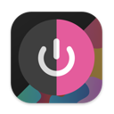
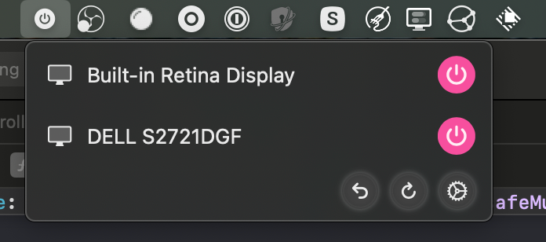

# DisplaySwitch
A macOS application that allows you to switch off your displays without unplugging them.

# Installing

Download the [latest release](/releases/latest) from the releases page and follow the instructions in the opened DMG file.

## Usage

Open the menu bar dropdown, or press the application icon in the dock to open if it doesn't fit inside of your menu bar.

## Screenshots
<table>
<tr>
    <th>Menu Bar</th>
    <th>Settings</th>
</tr>
    <td></td>
    <td></td>
</table>

## Contributing

Clone the repo and make a PR :3